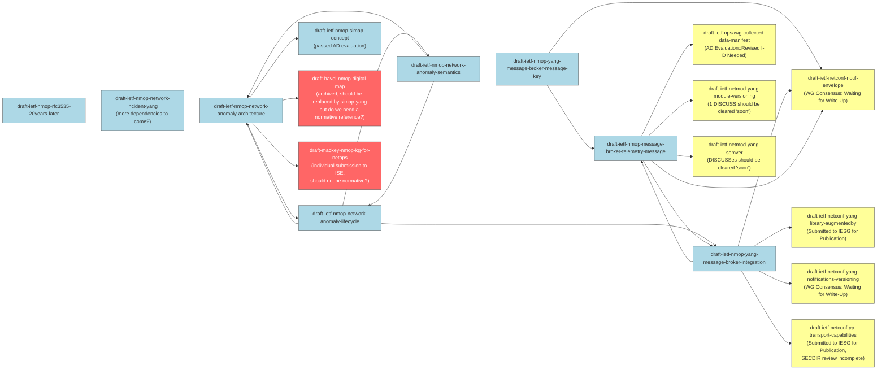

```mermaid
flowchart LR
    classDef blue fill:#add8e6,stroke:#555
    classDef red fill:#ff6666,color:#fff,stroke:#555
    classDef yellow fill:#ffff99,stroke:#555

    rfc3535["draft-ietf-nmop-rfc3535-20years-later"]
    incident["draft-ietf-nmop-network-incident-yang<br/>(more dependencies to come?)"]
    arch["draft-ietf-nmop-network-anomaly-architecture"]
    life["draft-ietf-nmop-network-anomaly-lifecycle"]
    simap["draft-ietf-nmop-simap-concept<br/>(passed AD evaluation)"]
    digitalmap["draft-havel-nmop-digital-map<br/>(archived, should be replaced by simap-yang<br/>but do we need a normative reference?)"]
    kg["draft-mackey-nmop-kg-for-netops<br/>(individual submission to ISE,<br/>should not be normative?)"]
    sem["draft-ietf-nmop-network-anomaly-semantics"]
    mbmk["draft-ietf-nmop-yang-message-broker-message-key"]
    mbi["draft-ietf-nmop-yang-message-broker-integration"]
    mbtm["draft-ietf-nmop-message-broker-telemetry-message"]
    notifenv["draft-ietf-netconf-notif-envelope<br/>(WG Consensus: Waiting for Write-Up)"]
    manifest["draft-ietf-opsawg-collected-data-manifest<br/>(AD Evaluation::Revised I-D Needed)"]
    yangmod["draft-ietf-netmod-yang-module-versioning<br/>(1 DISCUSS should be cleared 'soon')"]
    semver["draft-ietf-netmod-yang-semver<br/>(DISCUSSes should be cleared 'soon')"]
    yangver["draft-ietf-netconf-yang-notifications-versioning<br/>(WG Consensus: Waiting for Write-Up)"]
    yanglib["draft-ietf-netconf-yang-library-augmentedby<br/>(Submitted to IESG for Publication)"]
    yptrans["draft-ietf-netconf-yp-transport-capabilities<br/>(Submitted to IESG for Publication,<br/>SECDIR review incomplete)"]

    %% Pin isolated nodes and arch to left column
    rfc3535 ~~~ incident ~~~ arch

    %% Pin mbmk to same depth as sem (centre column)
    sem ~~~ mbmk

    arch --> life
    arch --> simap
    arch --> digitalmap
    arch --> kg

    sem --> arch
    sem --> life
    life --> arch
    life --> sem
    life --> mbi

    mbmk --> notifenv
    mbmk --> mbtm

    mbi --> yanglib
    mbi --> notifenv
    mbi --> yangver
    mbi --> yptrans
    mbi --> mbtm

    mbtm --> notifenv
    mbtm --> yangmod
    mbtm --> semver
    mbtm --> mbi
    mbtm --> manifest

    class arch,sem,life,simap,mbi,mbtm,mbmk,incident,rfc3535 blue
    class digitalmap,kg red
    class manifest,notifenv,yangver,yanglib,yptrans,yangmod,semver yellow


```
